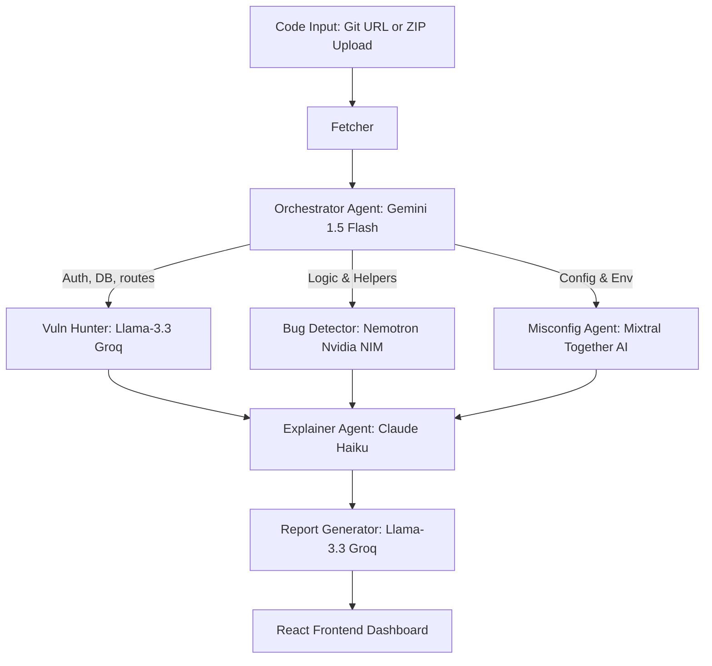

# VulnLens Pro

An AI-powered multi-agent code security scanning application built with FastAPI and React. It orchestrates multiple AI agents (using Google Gemini, Groq/Llama-3.3, Nvidia NIM/Nemotron, Together AI/Mixtral, and Claude Haiku) through a compiled **LangGraph** flow to identify vulnerabilities, logic bugs, and misconfigurations, translating raw outputs into plain, jargon-free English for students.

## Agent Pipeline Workflow



## Features

- **Multi-Agent Orchestration**: Structured pipeline with parallel execution of specialist security LLMs.
- **Jargon-Free Explanations**: Target remediation guides and plain-text descriptions written specifically for student learning.
- **Automatic Fallback / Demo Mode**: Runs scanning automatically via a mock fallback system if API keys are not provided.
- **Vulnerability Cards**: Interactive results page displaying details color-coded by severity.

---

## Getting Started

### 1. Requirements

- Python 3.11+
- Node.js 18+

### 2. Backend Setup

1. Navigate to the backend directory:
   ```bash
   cd backend
   ```

2. Create a virtual environment and activate it:
   ```bash
   python -m venv venv
   source venv/bin/activate  # On Windows: venv\Scripts\activate
   ```

3. Install dependencies:
   ```bash
   pip install -r requirements.txt
   ```

4. Configure your environment keys in `.env` (you can copy `.env.example` to `.env`):
   ```bash
   cp .env.example .env
   ```
   *Note: If any API keys are left blank, VulnLens Pro automatically runs in Demo Fallback Mode to allow testing UI panels without active billing endpoints.*

5. Run the server:
   ```bash
   uvicorn main:app --host 0.0.0.0 --port 8000 --reload
   ```

### 3. Frontend Setup

1. Navigate to the frontend directory:
   ```bash
   cd frontend
   ```

2. Install dependencies:
   ```bash
   npm install
   ```

3. Run the development server:
   ```bash
   npm run dev
   ```

4. Open [http://localhost:5173](http://localhost:5173) in your browser.
